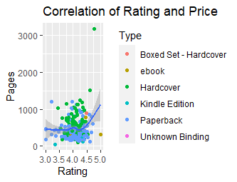
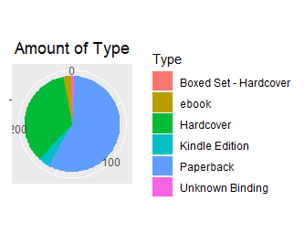

# R-Assignment 4

**Created by Denphum Nakglam (ID: 63130500039)**

Choose Dataset:
1. Top 270 Computer Science / Programing Books (Data from Thomas Konstantin, [Kaggle](https://www.kaggle.com/thomaskonstantin/top-270-rated-computer-science-programing-books)) >> [Using CSV](https://raw.githubusercontent.com/safesit23/INT214-Statistics/main/datasets/prog_book.csv)

### Outlines
1. Explore the dataset
2. Learning function from Tidyverse
3. Transform data with dplyr and finding insight the data
4. Visualization with GGplot2

## Part 1: Explore the dataset

```R
# Library
library(dplyr, readr, ggplot2)

# Dataset
ComSci_book <- read.csv("https://raw.githubusercontent.com/safesit23/INT214-Statistics/main/datasets/prog_book.csv")
```

In this dataset has 271 rows and 7 columns are Rating, Reviews, Book_title, Description, Number_of_pages, Type and Price

## Part 2: Learning function from Tidyverse

- Function `filter()` from package [dplyr](https://dplyr.tidyverse.org/articles/dplyr.html#select-columns-with-select). It using for filter dataset that you want or using for filter `summarise()`.

```R
starwars %>% filter(species == "Human")

starwars %>% group_by(eye_color) %>% summarise(ec = n()) %>% filter(ec == max(ec))
```

## Part 3: Transform data with dplyr and finding insight the data

3.1) Average rating of each book type

```R
ComSci_rating_type <- ComSci_book %>% 
  select(Type, Rating) %>% 
  group_by(Type) %>% 
  summarise(Rating = mean(Rating, na.rm = T))

ComSci_rating_type
```

Result:

```
  Type                  Rating
  <chr>                  <dbl>
1 Boxed Set - Hardcover   4.49
2 ebook                   4.29
3 Hardcover               4.06
4 Kindle Edition          4.01
5 Paperback               4.06
6 Unknown Binding         3.99
```

3.2) Most type of top 270 book

```R
ComSci_most_type <- ComSci_book %>% 
  group_by(Type) %>% 
  summarise(most_type = n()) %>%
  filter(most_type == max(most_type))
            
ComSci_most_type
```

Result:

```
  Type      most_type
  <chr>         <int>
1 Paperback       156
```

3.3) Type of book that rating has under overall average

```R
avgRating <- ComSci_book %>%
  summarise(avg_rating = mean(Rating, na.rm = T))

ComSci_avg_rating <- ComSci_book %>% 
  select(Type, Rating) %>%
  group_by(Type) %>%
  summarise(avg_Rtype = mean(Rating, na.rm = T)) %>%
  filter(avg_Rtype < avgRating$avg_rating)

ComSci_avg_rating
```

Result:

```
  Type            avg_Rtype
  <chr>               <dbl>
1 Hardcover            4.06
2 Kindle Edition       4.01
3 Paperback            4.06
4 Unknown Binding      3.99
```

3.4) Price at quantiles 25% of each type except type "Boxed Set - Hardcover" 

```R
ComSci_quantile_price <- ComSci_book %>% 
  select(Type, Price) %>% 
  group_by(Type) %>% 
  summarise(q_price = quantile(Price,.25)) %>%
  filter(Type != "Boxed Set - Hardcover")
  
ComSci_quantile_price
```

Result:

```
  Type            q_price
  <chr>             <dbl>
1 ebook              35.5
2 Hardcover          33.2
3 Kindle Edition     25.4
4 Paperback          30.3
5 Unknown Binding    36.7
```

3.5) Amount of book type and total price of each type

```R
ComSci_amount_type <- ComSci_book %>% 
  group_by(Type) %>%
  summarise(Amount_type = n(), Price = round(sum(Price), digits = 0))

ComSci_amount_type
```

Result:

```
  Type                  Amount_type Price
  <chr>                       <int> <dbl>
1 Boxed Set - Hardcover           1   220
2 ebook                           7   359
3 Hardcover                      95  6663
4 Kindle Edition                 10   324
5 Paperback                     156  7140
6 Unknown Binding                 2    74
```

3.6) Overall average rating and overall average pages

```R
rating_pages_avg <- ComSci_book %>% 
  summarise(Avg_rating = round(mean(Rating), digits = 0), Avg_pages = round(mean(Number_Of_Pages), digits = 0))

rating_pages_avg
```

Result:

```
  Avg_rating Avg_pages
1          4       475
```

###Explain

- result show type of book and average rating of each type
- Paperback is the most book of "Top 270 Computer Science / Programing Books" 
- result show type of book that rating has under overall average
- result show type of book and price at quantile 25% of each type except type "Boxed Set - Hardcover"
- result show type, amount, and total price of a book of each type
- Overall average rating is 4 and overall average pages is 475

## Part 4: Visualization with GGplot2
### 1.) Graph show scatter plot of rating and price.

```R
sc <- ComSci_book %>%
  ggplot(aes(x = Rating, y = Number_Of_Pages)) + 
  geom_point(aes(color = Type)) +
  xlab("Rating") +
  ylab("Pages") +
  ggtitle("Correlation of Rating and Price")

sc+geom_smooth()          

```
Result:



### 2.) Graph show pie chart of amount of type.

```R
pie <- ComSci_book %>% 
  ggplot(aes(x = "" , fill = factor(Type))) +
  geom_bar(width = 1) +
  theme(axis.line = element_blank(), 
        plot.title = element_text(hjust=0.5)) + 
  labs(fill="Type", 
       x=NULL, 
       y=NULL, 
       title="Amount of Type")

pie + coord_polar(theta = "y", start=0)        

```
Result:


