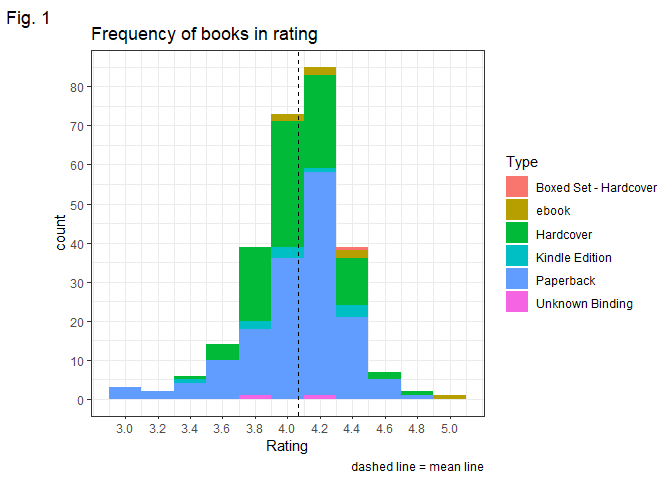

R-Assignment 4
================

**Created by Songglod Petchamras (ID: 63130500042)**

### Choose Dataset:

-   Top 270 Computer Science/Programming Books (Data from Thomas
    Konstantin,
    [Kaggle](https://www.kaggle.com/thomaskonstantin/top-270-rated-computer-science-programing-books)) >\>
    [Using
    CSV](https://raw.githubusercontent.com/safesit23/INT214-Statistics/main/datasets/prog_book.csv)

### Outlines

1.  Explore the dataset
2.  Learning function from Tidyverse
3.  Transform data with dplyr and finding insight the data
4.  Visualization with ggplot2

## Part 1: Explore the dataset

### Load necessary packages

``` r
packages <- c("dplyr", "readr", "ggplot2", "scales", "stringr")
lapply(packages, library, character.only = T)
```

    ## 
    ## Attaching package: 'dplyr'

    ## The following objects are masked from 'package:stats':
    ## 
    ##     filter, lag

    ## The following objects are masked from 'package:base':
    ## 
    ##     intersect, setdiff, setequal, union

    ## 
    ## Attaching package: 'scales'

    ## The following object is masked from 'package:readr':
    ## 
    ##     col_factor

    ## [[1]]
    ## [1] "dplyr"     "stats"     "graphics"  "grDevices" "utils"     "datasets" 
    ## [7] "methods"   "base"     
    ## 
    ## [[2]]
    ## [1] "readr"     "dplyr"     "stats"     "graphics"  "grDevices" "utils"    
    ## [7] "datasets"  "methods"   "base"     
    ## 
    ## [[3]]
    ##  [1] "ggplot2"   "readr"     "dplyr"     "stats"     "graphics"  "grDevices"
    ##  [7] "utils"     "datasets"  "methods"   "base"     
    ## 
    ## [[4]]
    ##  [1] "scales"    "ggplot2"   "readr"     "dplyr"     "stats"     "graphics" 
    ##  [7] "grDevices" "utils"     "datasets"  "methods"   "base"     
    ## 
    ## [[5]]
    ##  [1] "stringr"   "scales"    "ggplot2"   "readr"     "dplyr"     "stats"    
    ##  [7] "graphics"  "grDevices" "utils"     "datasets"  "methods"   "base"

### Load dataset

``` r
dt <- read_csv("https://raw.githubusercontent.com/safesit23/INT214-Statistics/main/datasets/prog_book.csv")
```

    ## Rows: 271 Columns: 7

    ## -- Column specification --------------------------------------------------------
    ## Delimiter: ","
    ## chr (3): Book_title, Description, Type
    ## dbl (3): Rating, Number_Of_Pages, Price

    ## 
    ## i Use `spec()` to retrieve the full column specification for this data.
    ## i Specify the column types or set `show_col_types = FALSE` to quiet this message.

### Check the head of dataset

``` r
head(dt)
```

    ## # A tibble: 6 x 7
    ##   Rating Reviews Book_title       Description        Number_Of_Pages Type  Price
    ##    <dbl>   <dbl> <chr>            <chr>                        <dbl> <chr> <dbl>
    ## 1   4.17    3829 The Elements of~ "This style manua~             105 Hard~  9.32
    ## 2   4.01    1406 The Information~ "James Gleick, th~             527 Hard~ 11   
    ## 3   3.33       0 Responsive Web ~ "In Responsive We~              50 Kind~ 11.3 
    ## 4   3.97    1658 Ghost in the Wi~ "If they were a h~             393 Hard~ 12.9 
    ## 5   4.06    1325 How Google Works "Both Eric Schmid~             305 Kind~ 13.2 
    ## 6   3.84     117 The Meme Machine "What is a meme? ~             288 Pape~ 14.2

``` r
# 2 columns have an inappropriate data type
```

### Change data type

``` r
dt <- dt %>%
    mutate_at(.vars = c("Reviews", "Number_Of_Pages"), 
              .funs = as.integer) %>%
    mutate(Type = as.factor(Type))
```

### Explore section

``` r
# verify & explore
glimpse(dt)
```

    ## Rows: 271
    ## Columns: 7
    ## $ Rating          <dbl> 4.17, 4.01, 3.33, 3.97, 4.06, 3.84, 4.09, 4.15, 3.87, ~
    ## $ Reviews         <int> 3829, 1406, 0, 1658, 1325, 117, 5938, 1817, 2093, 0, 1~
    ## $ Book_title      <chr> "The Elements of Style", "The Information: A History, ~
    ## $ Description     <chr> "This style manual offers practical advice on improvin~
    ## $ Number_Of_Pages <int> 105, 527, 50, 393, 305, 288, 256, 368, 259, 128, 352, ~
    ## $ Type            <fct> Hardcover, Hardcover, Kindle Edition, Hardcover, Kindl~
    ## $ Price           <dbl> 9.323529, 11.000000, 11.267647, 12.873529, 13.164706, ~

``` r
# check N/A value
colSums(is.na(dt))
```

    ##          Rating         Reviews      Book_title     Description Number_Of_Pages 
    ##               0               0               0               0               0 
    ##            Type           Price 
    ##               0               0

``` r
# explore & summary
summary(dt)
```

    ##      Rating         Reviews        Book_title        Description       
    ##  Min.   :3.000   Min.   :   0.0   Length:271         Length:271        
    ##  1st Qu.:3.915   1st Qu.:   5.5   Class :character   Class :character  
    ##  Median :4.100   Median :  35.0   Mode  :character   Mode  :character  
    ##  Mean   :4.067   Mean   : 185.6                                        
    ##  3rd Qu.:4.250   3rd Qu.: 116.5                                        
    ##  Max.   :5.000   Max.   :5938.0                                        
    ##  Number_Of_Pages                     Type         Price        
    ##  Min.   :  50.0   Boxed Set - Hardcover:  1   Min.   :  9.324  
    ##  1st Qu.: 289.0   ebook                :  7   1st Qu.: 30.751  
    ##  Median : 384.0   Hardcover            : 95   Median : 46.318  
    ##  Mean   : 475.1   Kindle Edition       : 10   Mean   : 54.542  
    ##  3rd Qu.: 572.5   Paperback            :156   3rd Qu.: 67.854  
    ##  Max.   :3168.0   Unknown Binding      :  2   Max.   :235.650

### In this dataset, it has 271 rows and 7 columns

-   Rating
-   Reviews
-   Book_title
-   Description
-   Number_of_pages
-   Type
-   Price

## Part 2: Learning function from Tidyverse

-   Function `geom_vline()` and `geom_hline()` from package
    [ggplot2](https://ggplot2.tidyverse.org/reference/geom_abline.html)
-   These geoms add reference lines (sometimes called rules) to a plot,
    either horizontal, vertical, or diagonal (specified by slope and
    intercept). These are useful for annotating plots.
-   Use cases are in **Part 4**

## Part 3: Transform data with dplyr and finding insight the data

1.  Three book types (26 books) have ratings lower than all books
    accounted for 10% of all.

-   Paperback 19 books
-   Hardcover 6 books
-   Kindle Edition 1 book

``` r
# 1
result <- dt %>%
    filter(Rating < quantile(Rating, 0.1)) %>%
    group_by(Type) %>%
    summarise(amount = n(),
              avg.rating = mean(Rating),
              avg.price = mean(Price)) %>%
    arrange(desc(amount))

# view
result %>% mutate(avg.price = scales::dollar(avg.price))
```

    ## # A tibble: 3 x 4
    ##   Type           amount avg.rating avg.price
    ##   <fct>           <int>      <dbl> <chr>    
    ## 1 Paperback          19       3.44 $44.06   
    ## 2 Hardcover           6       3.60 $72.25   
    ## 3 Kindle Edition      1       3.33 $11.27

``` r
# output
result %>% summarise(total = sum(amount))
```

    ## # A tibble: 1 x 1
    ##   total
    ##   <int>
    ## 1    26

2.  These books have “C++” in the title (these all books are related to
    the C++ language). Based on the output, C++ Primer has the lowest
    price-per-page at $0.062/1 page.

``` r
# 2
cplus_table <- dt %>%
    filter(str_detect(Book_title, pattern = "(C|c)\\+\\+")) %>%
    select(-Description, -Reviews, -Type) %>%
    mutate(price.per.page = Price/Number_Of_Pages) %>%
    arrange(price.per.page)

# view
cplus_table %>% mutate(Price = scales::dollar(Price))
```

    ## # A tibble: 18 x 5
    ##    Rating Book_title                        Number_Of_Pages Price price.per.page
    ##     <dbl> <chr>                                       <int> <chr>          <dbl>
    ##  1   4.22 C++ Primer                                    976 $61.~         0.0627
    ##  2   4.08 The C++ Programming Language                 1040 $69.~         0.0667
    ##  3   4.2  Reviewing C++                                 546 $40.~         0.0741
    ##  4   3.58 The Boost C++ Libraries                       570 $50.~         0.0886
    ##  5   4.16 The C++ Standard Library: A Tuto~            1136 $113~         0.0997
    ##  6   4.33 More Effective C++                            336 $42.~         0.126 
    ##  7   4.1  API Design for C++                            472 $60.~         0.128 
    ##  8   4.24 C++ Templates: The Complete Guide             560 $79.~         0.141 
    ##  9   4.08 Accelerated C++: Practical Progr~             352 $51.~         0.146 
    ## 10   3.87 File Structures: An Object-Orien~             724 $108~         0.150 
    ## 11   4.23 Exceptional C++ Style: 40 New En~             325 $51.~         0.158 
    ## 12   4.24 Modern C++ Design: Generic Progr~             360 $58.~         0.162 
    ## 13   4.23 More Exceptional C++: 40 New Eng~             304 $51.~         0.169 
    ## 14   4.29 A Tour of C++                                 192 $40.~         0.209 
    ## 15   3.48 Optimized C++: Proven Techniques~             388 $83.~         0.214 
    ## 16   4.25 Inside the C++ Object Model                   304 $80.~         0.266 
    ## 17   4.21 Exceptional C++: 47 Engineering ~             208 $56.~         0.270 
    ## 18   4.2  C++ Coding Standards: 101 Rules,~             240 $66.~         0.278

``` r
# output
cplus_table %>% 
    mutate(Price = scales::dollar(Price)) %>%
    filter(price.per.page == min(price.per.page))
```

    ## # A tibble: 1 x 5
    ##   Rating Book_title Number_Of_Pages Price  price.per.page
    ##    <dbl> <chr>                <int> <chr>           <dbl>
    ## 1   4.22 C++ Primer             976 $61.19         0.0627

3.  These books have “Python” in the title (these all books are related
    to the Python language). Based on the output, four books have
    ratings below 25% among all Python books.

``` r
# 3
py_table <- dt %>%
    filter(str_detect(Book_title, pattern = "(P|p)ython")) %>%
    select(-Description, -Reviews, -Type) %>%
    arrange(desc(Rating))

# view
py_table %>% mutate(Price = scales::dollar(Price))
```

    ## # A tibble: 14 x 4
    ##    Rating Book_title                                       Number_Of_Pages Price
    ##     <dbl> <chr>                                                      <int> <chr>
    ##  1   4.67 Fluent Python: Clear, Concise, and Effective Pr~             792 $64.~
    ##  2   4.35 Python Crash Course: A Hands-On, Project-Based ~             560 $26.~
    ##  3   4.29 Effective Python: 59 Specific Ways to Write Bet~             227 $38.~
    ##  4   4.27 Automate the Boring Stuff with Python: Practica~             479 $33.~
    ##  5   4.23 Introduction to Computation and Programming Usi~             280 $49.~
    ##  6   4.13 Python for Data Analysis                                     400 $46.~
    ##  7   4.11 Invent Your Own Computer Games with Python, 3rd~             370 $26.~
    ##  8   4.11 How to Think Like a Computer Scientist: Learnin~             288 $36.~
    ##  9   4    Python Programming Books Set: Python Programmin~             446 $23.~
    ## 10   3.96 Learning Python                                             1214 $67.~
    ## 11   3.93 Data Science from Scratch: First Principles wit~             330 $46.~
    ## 12   3.91 Python Programming For Beginners: Quick And Eas~             190 $29.~
    ## 13   3.87 Learn Python The Hard Way                                    210 $38.~
    ## 14   3.86 Making Games with Python & Pygame                            366 $43.~

``` r
# output
py_table %>% 
    filter(Rating < quantile(Rating, 0.25)) %>%
    mutate(Price = scales::dollar(Price)) %>%
    arrange(Rating)
```

    ## # A tibble: 4 x 4
    ##   Rating Book_title                                        Number_Of_Pages Price
    ##    <dbl> <chr>                                                       <int> <chr>
    ## 1   3.86 Making Games with Python & Pygame                             366 $43.~
    ## 2   3.87 Learn Python The Hard Way                                     210 $38.~
    ## 3   3.91 Python Programming For Beginners: Quick And Easy~             190 $29.~
    ## 4   3.93 Data Science from Scratch: First Principles with~             330 $46.~

4.  These books have “Game” in the title (All books are related to Game
    programming or design). Based on the output, “3D Game Engine
    Architecture: Engineering Real-Time Applications with Wild Magic”
    has the lowest rating of all at 3.76.

``` r
# 4
game_table <- dt %>%
    filter(str_detect(Book_title, pattern = "(G|g)ame")) %>%
    select(-Description, -Reviews) %>%
    arrange(desc(Price))

# view
game_table %>% mutate(Price = scales::dollar(Price))
```

    ## # A tibble: 26 x 5
    ##    Rating Book_title                               Number_Of_Pages Type    Price
    ##     <dbl> <chr>                                              <int> <fct>   <chr>
    ##  1   3.76 3D Game Engine Architecture: Engineerin~             752 Hardco~ $203~
    ##  2   3.82 Game Programming Gems 3                              663 Hardco~ $143~
    ##  3   3.77 Game Programming Gems 4                              703 Hardco~ $139~
    ##  4   3.82 Game Programming Gems 6                              700 Hardco~ $119~
    ##  5   3.45 3D Game Engine Design: A Practical Appr~            1040 Hardco~ $117~
    ##  6   3.67 Game Engine Gems 1                                   362 Hardco~ $105~
    ##  7   4.35 Game Engine Architecture                            1052 Hardco~ $96.~
    ##  8   4.1  Essential Mathematics for Games and Int~             624 Hardco~ $94.~
    ##  9   4    Game Programming Gems                                600 Hardco~ $91.~
    ## 10   4.01 Game Programming Gems 2                              575 Hardco~ $91.~
    ## # ... with 16 more rows

``` r
# output
game_table %>%
    filter(boxplot.stats(game_table$Price)$out == Price) %>%
    mutate(Price = scales::dollar(Price))
```

    ## # A tibble: 1 x 5
    ##   Rating Book_title                                Number_Of_Pages Type    Price
    ##    <dbl> <chr>                                               <int> <fct>   <chr>
    ## 1   3.76 3D Game Engine Architecture: Engineering~             752 Hardco~ $203~

5.  These books have “Algorithm” in the title (All books are related to
    algorithms). Based on the output, The most book type is the
    hardcover type.

``` r
# 5
algo_table <- dt %>%
    filter(str_detect(Book_title, pattern = "(A|a)lgorithm")) %>%
    select(-Description, -Reviews) %>%
    group_by(Type) %>%
    summarise(amount = n(),
              avg.rating = mean(Rating),
              avg.price = mean(Price))

# view
algo_table %>% mutate(avg.price = scales::dollar(avg.price))
```

    ## # A tibble: 3 x 4
    ##   Type      amount avg.rating avg.price
    ##   <fct>      <int>      <dbl> <chr>    
    ## 1 ebook          1       4.16 $34.36   
    ## 2 Hardcover     10       4.13 $56.80   
    ## 3 Paperback      1       3.93 $53.17

``` r
# output
algo_table %>%
    filter(amount == max(amount)) %>%
    mutate(avg.price = scales::dollar(avg.price))
```

    ## # A tibble: 1 x 4
    ##   Type      amount avg.rating avg.price
    ##   <fct>      <int>      <dbl> <chr>    
    ## 1 Hardcover     10       4.13 $56.80

6.  The number of books that have high prices is 27 books accounted for
    10% of all.

-   Hardcover 21 books
-   Paperback 5 books
-   Boxed Set - Hardcover 1 book

``` r
# 6
dt %>%
    select(-Reviews, -Description) %>%
    filter(Price > quantile(Price, 0.9)) %>%
    group_by(Type) %>%
    summarise(amount = n(),
              avg.rating = mean(Rating),
              avg.price = mean(Price)) %>%
    arrange(desc(amount)) %>%
    mutate(avg.price = scales::dollar(avg.price))
```

    ## # A tibble: 3 x 4
    ##   Type                  amount avg.rating avg.price
    ##   <fct>                  <int>      <dbl> <chr>    
    ## 1 Hardcover                 21       4.03 $129.53  
    ## 2 Paperback                  5       4.08 $124.30  
    ## 3 Boxed Set - Hardcover      1       4.49 $220.39

## Part 4: Data Visualization with ggplot2

1.  The graph shows the frequency of books in rating, most of all books
    have ratings between 4.0 and 4.2

``` r
# fig. 1
dt %>% 
    ggplot(aes(x = Rating)) + 
    geom_histogram(binwidth = 0.2) +
    aes(fill = Type) +
    geom_vline(xintercept = mean(dt$Rating), linetype = "dashed") +
    scale_x_continuous(breaks = seq(3, 5, 0.2)) +
    scale_y_continuous(breaks = seq(0, 100, 10)) +
    labs(title = "Frequency of books in rating",
         caption = "dashed line = mean line",
         tag = "Fig. 1") +
    theme_bw()
```

<!-- -->

2.  The graph shows the correlation of Price and Number of Pages
    compared between Hardcover and Paperback.

-   Hardcover: If have more pages, higher prices
-   Paperback: prices and number of pages, most of all stick as a group
    and below the mean line

``` r
# fig. 2
dt %>%
    filter(Number_Of_Pages < 1500 & Price < 150) %>%
    filter(Type == "Hardcover" | Type == "Paperback") %>%
    ggplot(aes(x = Number_Of_Pages, y = Price)) +
    aes(color = Rating, size = Reviews) +
    geom_point() + 
    scale_color_distiller(palette = "RdPu") +
    facet_wrap(~Type) +
    geom_hline(yintercept = mean(dt$Price), linetype = "dashed", alpha = 0.5) +
    geom_vline(xintercept = mean(dt$Number_Of_Pages), linetype = "dashed", alpha = 0.5) +
    scale_x_continuous(breaks = seq(0, 1200, 200)) +
    scale_y_continuous(breaks = seq(0, 150, 10)) +
    stat_ellipse() +
    labs(title = "The correlation of Price and Number of Pages", 
         subtitle = "Comparison between the correlation of Price and Number of Pages in Hardcover and Paperback",
         caption = "dashed line = mean line",
         tag = "Fig. 2") +
    theme_bw()
```

<!-- -->
