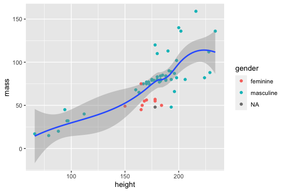

# R-Assignment 4

**Created by Name-Surname (ID: xxxxxxxxxx)**

Choose Dataset:
1. Top 270 Computer Science / Programing Books (Data from Thomas Konstantin, [Kaggle](https://www.kaggle.com/thomaskonstantin/top-270-rated-computer-science-programing-books)) >> [Using CSV](https://raw.githubusercontent.com/safesit23/INT214-Statistics/main/datasets/prog_book.csv)

2. Superstore Sales Dataset (Data from Rohit Sahoo,[Kaggle](https://www.kaggle.com/rohitsahoo/sales-forecasting)) >> [Using CSV](https://raw.githubusercontent.com/safesit23/INT214-Statistics/main/datasets/superstore_sales.csv)


### Outlines
1. Explore the dataset
2. Learning function from Tidyverse
3. Transform data with dplyr and finding insight the data
4. Visualization with GGplot2

## Part 1: Explore the dataset

```
# Library
library(name)

# Dataset
dataset <- read_csv("")
```

In this dataset has .....


## Part 2: Learning function from Tidyverse

- Function `select()` from package [dplyr](https://dplyr.tidyverse.org/articles/dplyr.html#select-columns-with-select)). It using for select columns

```
starwars %>% select(name,height)
```
** You can sepearate this part or combine in part of `Transform data with dplyr and finding insight the data`

## Part 3: Transform data with dplyr and finding insight the data

//Explain here

```
#Code here
```

Result:

```
#Copy Result from console to here
```
//Explain

- list 1
- list 2

## Part 4: Visualization with GGplot2
### 1.) Graph show relation between height and mass
```
scat_plot <- starwars %>% filter(mass<500) %>% ggplot(aes(x=height,y=mass))+
  geom_point(aes(color=gender))

scat_plot+geom_smooth()
```
Result:



**Guideline:
Embed Image by using this syntax in markdown file
````

````